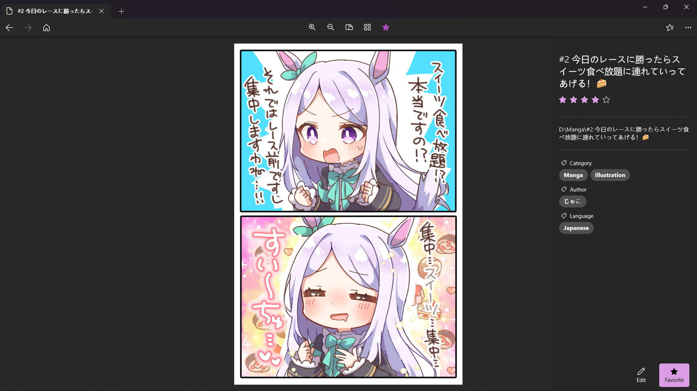

# Comic Reader
The Comic Reader is a modern Windows app written in C#. The app provided basic functionality for comic reading, as well as a few useful funtions such as info searching and editing.

Comic Reader irregularly ships with new features and bug fixes. You can get the latest version of Comic Reader in the [Microsoft Store](https://www.microsoft.com/store/apps/9NS9FG32DCP5).



## Features
- Vertical and horizontal reading mode.
- Fast navigation.
- Searching and editing titles, tags, ratings.
- Favorites and history.

## Getting started
Prerequisites:
- Your computer must be running Windows 10, version 1903 or newer.
- Install the latest version of [Visual Studio](https://developer.microsoft.com/en-us/windows/downloads) (the free community edition is sufficient).
  - Install the "Universal Windows Platform Development" workload.
  - Install the latest Windows 10 SDK.
- Install the [XAML Styler](https://marketplace.visualstudio.com/items?itemName=TeamXavalon.XAMLStyler) Visual Studio extension.
- Get the code:
    ```
    git clone https://github.com/aicd0/ComicReader.git
    ```
- Open [ComicReader.sln](src/ComicReader.sln) in Visual Studio to build and run the Comic Reader app.

## Contributing
If Comic Reader is not working properly, please [submit an issue on GitHub](https://github.com/aicd0/ComicReader/issues/new).

## License
Licensed under the [MIT License](./LICENSE).
